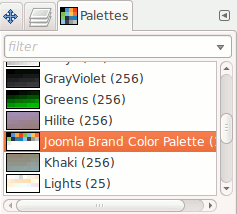
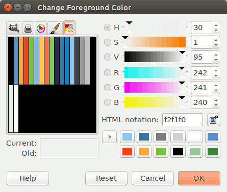
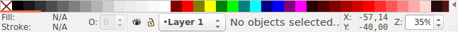
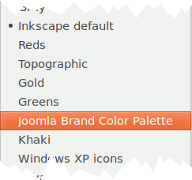
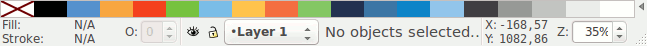

# Joomla Brand Color Palette

Joomla Brand Color palette for use with Inkscape and Gimp

## The Colors

The [Joomla Brand Manual] defines the colors used by the Joomla! project:

Primary colors:


Secondary colors:


Tertiary colors:


Neutral colors:


This palette provides easy access to these colors, supplemented with black and white.

## Installation

Download the file [`src/joomla.gpl`](src/joomla.gpl).
To enable the palette for a program, follow the instructions below.

### GIMP

Copy the file `joomla.gpl` to the GIMP `palettes` directory.
 
For Debian based distributions like **Ubuntu**:

  - Local install for the current user:
   
    ```bash
    $ sudo cp joomla.gpl ~/.gimp-2.8/palettes/joomla.gpl
    ```

  - Global install for all users:
  
    ```bash
    $ sudo cp joomla.gpl /usr/share/gimp/2.0/palettes/joomla.gpl
    ```

Start the program.
The “Palettes” dialog is a dockable dialog; see the section
[Section 2.3, “Dialogs and Docking”](https://docs.gimp.org/en/gimp-concepts-docks.html) in the GIMP documentation
for help on manipulating it.

You can access it:

  - from the image menu: `Windows` → `Dockable Dialogs` → `Palettes`;
  - from the Tab menu in any dockable dialog by clicking on the triangle right of the tabs

    

    and selecting `Add Tab` → `Palettes`.
    
    

That opens the palette dialog, floating in the first case, as a tab in the second.



Select *Joomla Brand Color Palette*.
The palette in the color chooser dialog gets replaced by the Joomla Brand Color Palette.



You're now ready to use the Joomla Brand Colors for your artwork.

### Inkscape

Copy the file `joomla.gpl` to the Inkscape `palettes` directory.
 
For Debian based distributions like **Ubuntu**:

```bash
$ sudo cp joomla.gpl /usr/share/inkscape/palettes/joomla.gpl
```

Start the program,
At the bottom of the program window, you'll see the default palette:



On the right side of the color swatches is a small triangle.
When you click on it, Inkscapes presents you a list of available palettes.



Select *Joomla Brand Color Palette*. The default palette at the bottom gets replaced by the Joomla Brand Color Palette.



You're now ready to use the Joomla Brand Colors for your artwork.
