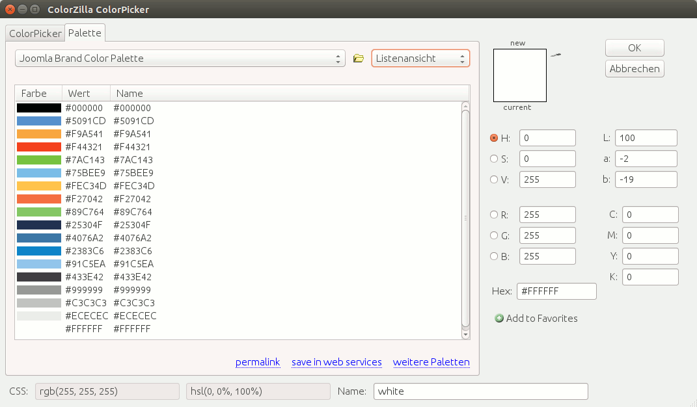

# Enable the Palette for ColorZilla

Download the file [`src/joomla.gpl`](src/joomla.gpl).
Copy `joomla.gpl` to the ColorZilla `palettes` directory.
 
For Debian based distributions like **Ubuntu**:

```bash
$ sudo cp joomla.gpl ~/.mozilla/firefox/<your.profile>>/colorzilla/palettes/joomla.gpl
```

Start Firefox,
From the menu, select `Extras` → `ColorZilla` → `Palette browser ...`.

Select *Joomla Brand Color Palette*.



You're now ready to use the Joomla Brand Colors with ColorZilla.
