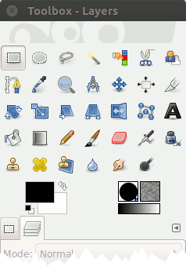
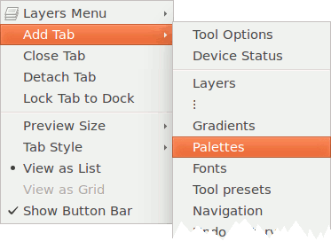
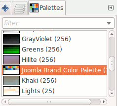
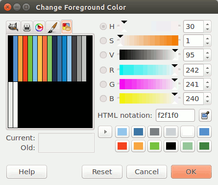

# Enable the Palette for GIMP

Download the file [`src/joomla.gpl`](src/joomla.gpl).
Copy `joomla.gpl` to the GIMP `palettes` directory.
 
For Debian based distributions like **Ubuntu**:

  - Local install for the current user:
   
    ```bash
    $ sudo cp joomla.gpl ~/.gimp-2.8/palettes/joomla.gpl
    ```

  - Global install for all users:
  
    ```bash
    $ sudo cp joomla.gpl /usr/share/gimp/2.0/palettes/joomla.gpl
    ```

Start the program.
The “Palettes” dialog is a dockable dialog; see the section
[Section 2.3, “Dialogs and Docking”](https://docs.gimp.org/en/gimp-concepts-docks.html) in the GIMP documentation
for help on manipulating it.

You can access it:

  - from the image menu: `Windows` → `Dockable Dialogs` → `Palettes`;
  - from the Tab menu in any dockable dialog by clicking on the triangle right of the tabs

    

    and selecting `Add Tab` → `Palettes`.
    
    

That opens the palette dialog, floating in the first case, as a tab in the second.



Select *Joomla Brand Color Palette*.
The palette in the color chooser dialog gets replaced by the Joomla Brand Color Palette.



You're now ready to use the Joomla Brand Colors for your artwork.

