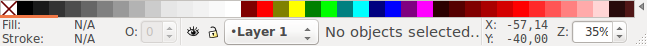
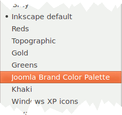
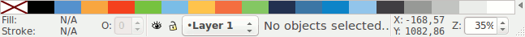

# Enable the Palette for Inkscape

Copy the file `joomla.gpl` to the Inkscape `palettes` directory.
 
For Debian based distributions like **Ubuntu**:

```bash
$ sudo cp joomla.gpl /usr/share/inkscape/palettes/joomla.gpl
```

Start the program,
At the bottom of the program window, you'll see the default palette:



On the right side of the color swatches is a small triangle.
When you click on it, Inkscapes presents you a list of available palettes.



Select *Joomla Brand Color Palette*. The default palette at the bottom gets replaced by the Joomla Brand Color Palette.



You're now ready to use the Joomla Brand Colors for your artwork.
