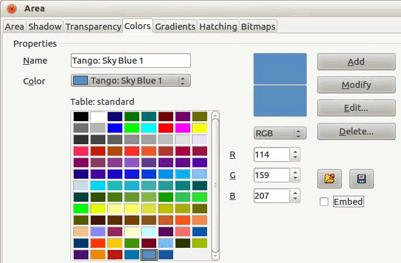
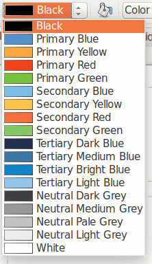

# Enable the Palette for LibreOffice Impress 4.2 or higher

Download the file [`src/joomla.soc`](src/joomla.soc).
Copy `joomla.soc` to the LibreOffice `config` directory.
 
For Debian based distributions like **Ubuntu**:

  - Local install for the current user:

    ```bash
    $ sudo cp joomla.soc ~/.config/libreoffice/4/user/config/joomla.soc
    ```
    
Start the LibreOffice Impress.
Open the Area dialog by selecting `Format` → `Area` on the Menu bar,
then selecting the Colors tab.



To load the Joomla Brand Colors palette, click on the Load Color List icon
.
At least in version 4.2, a warning 'The list was modified without saving.' appears.
This is a bug. Just click on `OK`.

Choose `joomla.soc`. Click `OK` to activate the palette and close the dialog.
The default palettes in the toolbar for the line and the area colors get replaced by the Joomla Brand Color Palette.



You're now ready to use the Joomla Brand Colors for your artwork.
